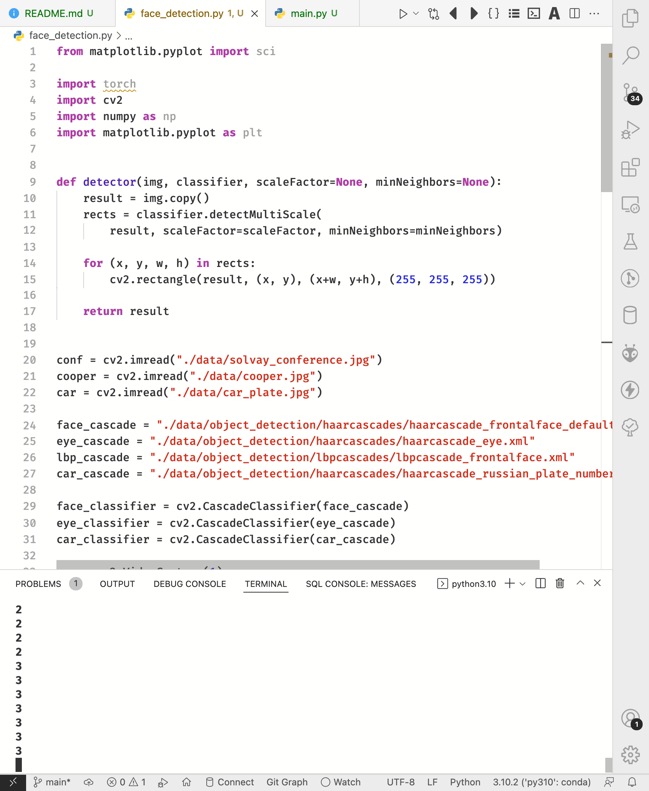
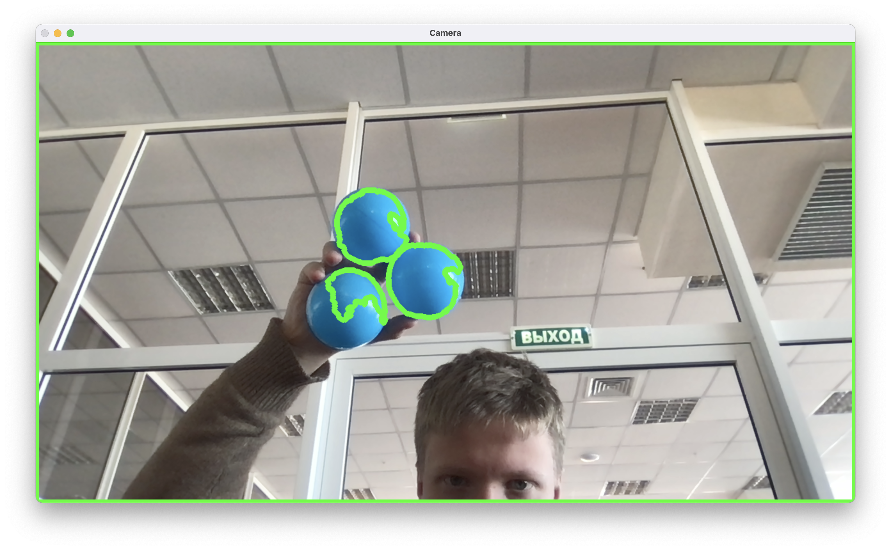

# Обнаружение объектов

- [`colored_balls_segmentation` - Сегментация цветных шаров](/colored_balls_segmentation.py.py)
- [`face_detection` - Наложение маски на лицо, подобное Instagram](/face_detection.py) **(Недоделанное)**

### Демонстрация - [`colored_balls_segmentation`](/colored_balls_segmentation.py)

|  |
| ------------------- |
|  |

